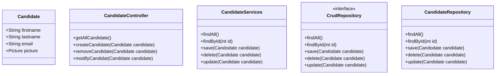

# CANDIDATE CLASS
1. This is the candidate complete candidate class for the pool project

```mermaid
classDiagram
    class Candidate
    Candidate : +String firstname
    Candidate : +String lastname
    Candidate : +String email
    Candidate : +Picture picture
    
    class CandidateController
    CandidateController : +getAllCandidate()
    CandidateController : +createCandidate(Candidate candidate)
    CandidateController : +removeCandidate(Candidate candidate)
    CandidateController : +modifyCandidat(Candidate candidate)
    
    class CandidateServices
    CandidateServices : +findAll()
    CandidateServices: +findById(int id)
    CandidateServices: +save(Candodate candidate)
    CandidateServices: +delete(Candidate candidate)
    CandidateServices: +update(Candidate candidate)

    class CrudRepository
    <<interface>> CrudRepository
    CrudRepository : +findAll()
    CrudRepository: +findById(int id)
    CrudRepository: +save(Candodate candidate)
    CrudRepository: +delete(Candidate candidate)
    CrudRepository: +update(Candidate candidate)
    
    class CandidateRepository
    CandidateRepository : +findAll()
    CandidateRepository: +findById(int id)
    CandidateRepository: +save(Candodate candidate)
    CandidateRepository: +delete(Candidate candidate)
    CandidateRepository: +update(Candidate candidate)
    
```