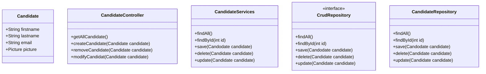
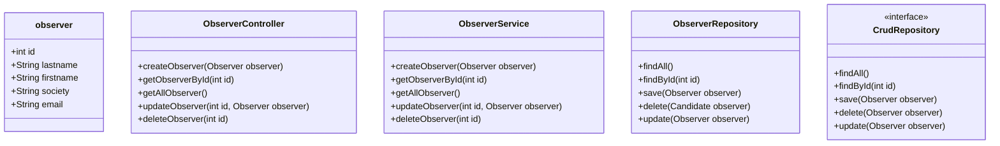
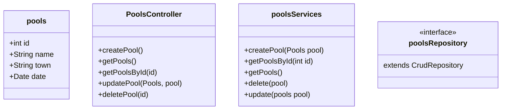
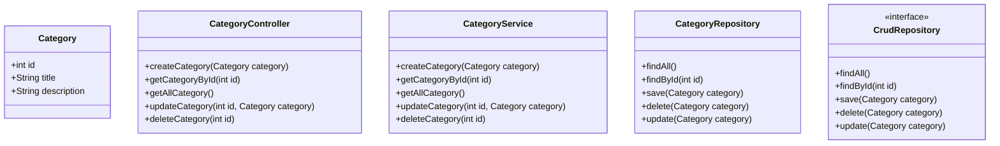
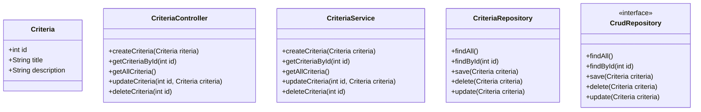

# CANDIDATE CLASS
1. This is the candidate complete candidate class for the pool project

# OBSERVER CLASS
- It's the complete Observer class for project

# Pools class

# CATEGORY CLASS
- It's the complete Category class for project

# CRITERIA ENTITIES
- It's the complete Criteria class for project
